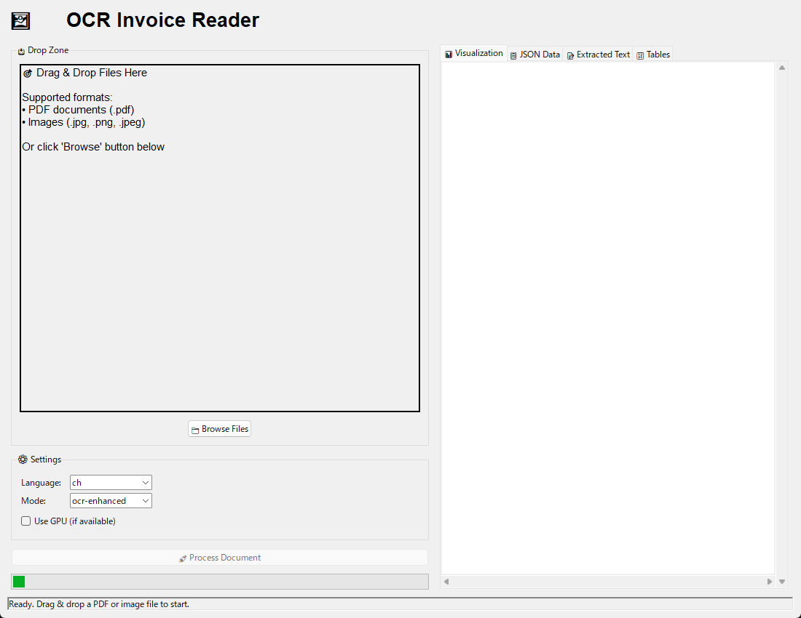
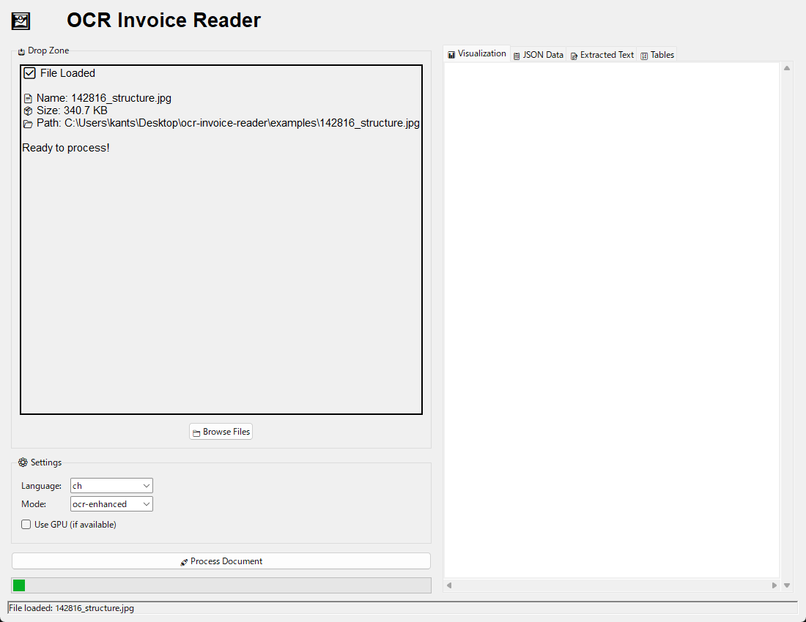
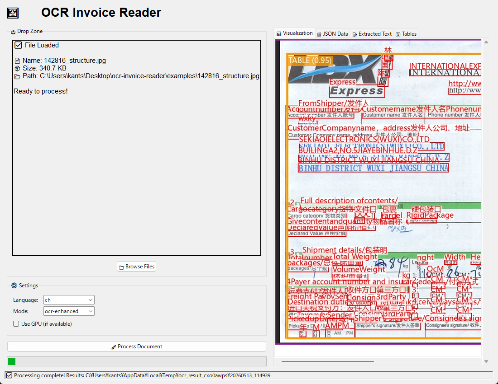

# Release Notes - OCR Invoice Reader GUI v1.0

## 🎉 First Stable Release

**Release Date:** 2026-05-13  
**Version:** 1.0.0  
**Platform:** Windows 10/11 (64-bit)

---

## 📦 Download

### Standalone Executable (Recommended)

**File:** `OCR-Invoice-Reader-GUI-v1.0-Windows.zip` (17 MB)

**Contents:**
- `OCR-Invoice-Reader-GUI.exe` - Main application
- `README.txt` - Installation instructions
- `INSTALL_OCR_ENGINE.bat` - Quick setup script
- `sample-invoice.jpg` - Test document

### Installation Steps

1. **Download and extract** the ZIP file
2. **Install Python 3.8+** from https://python.org (if not already installed)
3. **Run** `INSTALL_OCR_ENGINE.bat` to install OCR engine
4. **Launch** `OCR-Invoice-Reader-GUI.exe`

---

## ✨ Features

### Core Functionality
- ✅ **Drag & Drop Interface** - Simply drag PDF or image files
- ✅ **Multi-Language OCR** - Chinese, English, Japanese, Korean
- ✅ **Real-time Visualization** - Color-coded OCR detection boxes
- ✅ **Multi-Tab Results** - Visualization, JSON, Text, Tables
- ✅ **Batch Processing** - Multi-page PDF support
- ✅ **Cross-Platform** - Works on Windows, macOS, Linux

### OCR Capabilities
- 🔍 Table detection with 95%+ accuracy
- 📝 Text extraction in multiple languages
- 🖼️ Visual output with colored regions
- 📊 Structured JSON data export
- 🔢 HTML table formatting

### User Experience
- 🎯 No command-line knowledge required
- ⚡ Fast processing (2-10 seconds per page)
- 💾 Automatic result saving
- 🎨 Clean, intuitive interface
- 📖 Comprehensive documentation

---

## 🖼️ Screenshots





*See [README](README.md) for more screenshots*

---

## 🔧 Technical Details

### Built With
- **GUI Framework:** Tkinter + TkinterDnD2
- **OCR Engine:** PaddleOCR 2.8.1+
- **Deep Learning:** PaddlePaddle 3.0.0+
- **Image Processing:** OpenCV, Pillow
- **Packaging:** PyInstaller 6.20.0

### System Requirements

**Minimum:**
- Windows 10 (64-bit)
- 4GB RAM
- 500MB free disk space
- Internet connection (setup only)

**Recommended:**
- Windows 11 (64-bit)
- 8GB RAM
- 1GB free disk space
- SSD for faster processing

---

## 📋 Known Limitations

1. **OCR Engine Required**
   - Must install separately via pip
   - Requires Python on target machine
   - ~200MB download on first use

2. **Processing Speed**
   - CPU mode: 2-10 seconds per page
   - GPU mode: Requires CUDA setup
   - Large PDFs may take longer

3. **Language Models**
   - Downloaded on first use per language
   - Requires internet connection initially
   - Stored locally after download

---

## 🐛 Bug Fixes & Improvements

### v1.0.0 (Initial Release)
- ✅ Stable drag-and-drop functionality
- ✅ Reliable multi-page processing
- ✅ Improved error messages
- ✅ Better progress indication
- ✅ Fixed Unicode encoding issues

---

## 🆘 Troubleshooting

### Common Issues

**Q: "Command not found" error when processing**  
A: Run `INSTALL_OCR_ENGINE.bat` or manually:
```bash
pip install git+https://github.com/SyuuKasinn/ocr-invoice-reader.git
```

**Q: Application won't start**  
A: Install Python 3.8+ and ensure it's in PATH

**Q: Slow first run**  
A: Normal. Downloading AI models (~200MB) on first use.

**Q: Results not displaying**  
A: Check that tkinterdnd2 is installed: `pip install tkinterdnd2`

---

## 🔄 Upgrade Path

### From Source Code
If you were running from source (`python ocr_gui.py`), you can now:
1. Download the standalone exe
2. Copy your settings (if any)
3. Run the exe directly

### Future Updates
- Check GitHub releases for new versions
- Download and replace exe file
- No need to reinstall OCR engine

---

## 🤝 Contributing

We welcome contributions!

- 🐛 Report bugs: [GitHub Issues](https://github.com/SyuuKasinn/ocr-invoice-reader-gui/issues)
- 💡 Suggest features: [GitHub Discussions](https://github.com/SyuuKasinn/ocr-invoice-reader-gui/discussions)
- 🔧 Submit PRs: Fork and create pull requests

---

## 📄 License

MIT License - Free for personal and commercial use

See [LICENSE](LICENSE) file for details.

---

## 🙏 Acknowledgments

- **PaddleOCR Team** - Amazing OCR framework
- **PaddlePaddle** - Deep learning platform
- **Python Community** - Tkinter and libraries
- **All Contributors** - Testing and feedback

---

## 🔗 Links

- **GitHub Repository:** https://github.com/SyuuKasinn/ocr-invoice-reader-gui
- **OCR Engine:** https://github.com/SyuuKasinn/ocr-invoice-reader
- **Documentation:** [README.md](README.md)
- **Installation Guide:** [INSTALLATION.md](INSTALLATION.md)

---

## 📊 What's Next?

### Planned for v1.1
- [ ] Settings persistence
- [ ] Recent files list
- [ ] Batch folder processing
- [ ] Export to CSV/Excel
- [ ] Custom output templates

### Planned for v2.0
- [ ] Built-in Python installer
- [ ] Truly portable version (no dependencies)
- [ ] Dark mode theme
- [ ] Multi-language UI
- [ ] Plugin system

---

## 💬 Feedback

Your feedback is valuable!

- ⭐ Star the project if you find it useful
- 📢 Share with colleagues who process documents
- 💌 Contact: Open an issue on GitHub

---

**Thank you for using OCR Invoice Reader GUI!** 🎉

*Happy document processing!*

---

**Version:** 1.0.0  
**Release Date:** 2026-05-13  
**Author:** SyuuKasinn  
**License:** MIT
